# 策略知识图谱

生成日期：2026-05-20

这个图谱把 300 条陌生人关系建立策略连接到阶段、目标、内容形式、用户心理、资料来源和关键词，并额外生成策略之间的前置、承接、增强和同源关系。

## 图谱文件

- `strategy_knowledge_graph.json`：完整节点和边，适合程序读取。
- `strategy_knowledge_graph.mmd`：Mermaid 摘要图，适合快速看阶段链路和典型策略路径。
- `strategy_edges.csv`：策略间关系边，适合表格查询。

## 节点统计

| 节点类型 | 数量 |
| --- | --- |
| format | 10 |
| goal | 10 |
| keyword | 46 |
| psychology | 9 |
| source | 41 |
| stage | 9 |
| strategy | 300 |

## 边统计

| 关系 | 数量 |
| --- | --- |
| addresses_psychology | 677 |
| aims_at | 681 |
| classified_as | 300 |
| continues_to | 270 |
| depends_on | 267 |
| derived_from | 681 |
| reinforces | 300 |
| same_source_family | 122 |
| tagged_with | 1504 |
| uses_format | 561 |

## Mermaid 摘要

```mermaid
flowchart LR
  classDef stage fill:#eef6ff,stroke:#4b86c5,color:#14395b;
  classDef strategy fill:#fffdf5,stroke:#d1a83a,color:#312400;
  S1["S1 陌生人画像与边界策略"]:::stage
  S2["S2 主页可信与安全感策略"]:::stage
  S3["S3 内容吸引与共同兴趣策略"]:::stage
  S4["S4 公共互动与破冰策略"]:::stage
  S5["S5 私信熟悉与倾听策略"]:::stage
  S6["S6 小资源互助策略"]:::stage
  S7["S7 长期朋友关系维护策略"]:::stage
  S8["S8 关系复盘与迭代策略"]:::stage
  S9["S9 学习提升策略"]:::stage
  S1 --> S2
  S2 --> S3
  S3 --> S4
  S4 --> S5
  S5 --> S6
  S6 --> S7
  S7 --> S8
  S8 --> S9

  IGS_S1_G04["IGS-S1-G04<br/>小众人群用语扫描"]:::strategy
  S1 -.包含.-> IGS_S1_G04
  IGS_S2_G01["IGS-S2-G01<br/>Bio 第一行人群锁定"]:::strategy
  S2 -.包含.-> IGS_S2_G01
  IGS_S1_G04 --> IGS_S2_G01
  IGS_S3_G10["IGS-S3-G10<br/>对方问题口播"]:::strategy
  S3 -.包含.-> IGS_S3_G10
  IGS_S2_G01 --> IGS_S3_G10
  IGS_S4_G16["IGS-S4-G16<br/>高意向评论转私信"]:::strategy
  S4 -.包含.-> IGS_S4_G16
  IGS_S3_G10 --> IGS_S4_G16
  IGS_S5_G02["IGS-S5-G02<br/>复述再建议"]:::strategy
  S5 -.包含.-> IGS_S5_G02
  IGS_S4_G16 --> IGS_S5_G02
  IGS_S6_G04["IGS-S6-G04<br/>脚本库小资源"]:::strategy
  S6 -.包含.-> IGS_S6_G04
  IGS_S5_G02 --> IGS_S6_G04
  IGS_S7_G01["IGS-S7-G01<br/>周一目标仪式"]:::strategy
  S7 -.包含.-> IGS_S7_G01
  IGS_S6_G04 --> IGS_S7_G01
  IGS_S8_G15["IGS-S8-G15<br/>评论情绪标签"]:::strategy
  S8 -.包含.-> IGS_S8_G15
  IGS_S7_G01 --> IGS_S8_G15
  IGS_S9_G03["IGS-S9-G03<br/>NVC 句式练习"]:::strategy
  S9 -.包含.-> IGS_S9_G03
  IGS_S8_G15 --> IGS_S9_G03
  %% chain 1
  IGS_S1_G09["IGS-S1-G09<br/>关注前疑虑清单"]:::strategy
  S1 -.包含.-> IGS_S1_G09
  IGS_S2_G07["IGS-S2-G07<br/>FAQ 防御性问题前置"]:::strategy
  S2 -.包含.-> IGS_S2_G07
  IGS_S1_G09 --> IGS_S2_G07
  IGS_S3_G21["IGS-S3-G21<br/>反对意见 Carousel"]:::strategy
  S3 -.包含.-> IGS_S3_G21
  IGS_S2_G07 --> IGS_S3_G21
  IGS_S4_G15["IGS-S4-G15<br/>分歧降温回应"]:::strategy
  S4 -.包含.-> IGS_S4_G15
  IGS_S3_G21 --> IGS_S4_G15
  IGS_S5_G07["IGS-S5-G07<br/>对比声明"]:::strategy
  S5 -.包含.-> IGS_S5_G07
  IGS_S4_G15 --> IGS_S5_G07
  IGS_S6_G16["IGS-S6-G16<br/>小资源适用边界"]:::strategy
  S6 -.包含.-> IGS_S6_G16
  IGS_S5_G07 --> IGS_S6_G16
  IGS_S7_G15["IGS-S7-G15<br/>冲突修复模板"]:::strategy
  S7 -.包含.-> IGS_S7_G15
  IGS_S6_G16 --> IGS_S7_G15
  IGS_S8_G06["IGS-S8-G06<br/>私信阶段漏斗"]:::strategy
  S8 -.包含.-> IGS_S8_G06
  IGS_S7_G15 --> IGS_S8_G06
  IGS_S9_G05["IGS-S9-G05<br/>关键对话脚本库"]:::strategy
  S9 -.包含.-> IGS_S9_G05
  IGS_S8_G06 --> IGS_S9_G05
  %% chain 2
  IGS_S1_G11["IGS-S1-G11<br/>竞品评论高频词"]:::strategy
  S1 -.包含.-> IGS_S1_G11
  IGS_S2_G11["IGS-S2-G11<br/>九宫格首屏检查"]:::strategy
  S2 -.包含.-> IGS_S2_G11
  IGS_S1_G11 --> IGS_S2_G11
  IGS_S3_G15["IGS-S3-G15<br/>Carousel 第一页单承诺"]:::strategy
  S3 -.包含.-> IGS_S3_G15
  IGS_S2_G11 --> IGS_S3_G15
  IGS_S4_G14["IGS-S4-G14<br/>评论区 FAQ 收集"]:::strategy
  S4 -.包含.-> IGS_S4_G14
  IGS_S3_G15 --> IGS_S4_G14
  IGS_S5_G23["IGS-S5-G23<br/>小资源后反馈钩"]:::strategy
  S5 -.包含.-> IGS_S5_G23
  IGS_S4_G14 --> IGS_S5_G23
  IGS_S6_G08["IGS-S6-G08<br/>DM 关键词小资源"]:::strategy
  S6 -.包含.-> IGS_S6_G08
  IGS_S5_G23 --> IGS_S6_G08
  IGS_S7_G14["IGS-S7-G14<br/>社群聆听小时"]:::strategy
  S7 -.包含.-> IGS_S7_G14
  IGS_S6_G08 --> IGS_S7_G14
  IGS_S8_G08["IGS-S8-G08<br/>主题热力图"]:::strategy
  S8 -.包含.-> IGS_S8_G08
  IGS_S7_G14 --> IGS_S8_G08
  IGS_S9_G10["IGS-S9-G10<br/>数据假设训练"]:::strategy
  S9 -.包含.-> IGS_S9_G10
  IGS_S8_G08 --> IGS_S9_G10
  %% chain 3
  IGS_S1_G01["IGS-S1-G01<br/>新认识的人来源画像"]:::strategy
  S1 -.包含.-> IGS_S1_G01
  IGS_S2_G20["IGS-S2-G20<br/>免费资源门牌"]:::strategy
  S2 -.包含.-> IGS_S2_G20
  IGS_S1_G01 --> IGS_S2_G20
  IGS_S3_G24["IGS-S3-G24<br/>开放问题限缩"]:::strategy
  S3 -.包含.-> IGS_S3_G24
  IGS_S2_G20 --> IGS_S3_G24
  IGS_S4_G12["IGS-S4-G12<br/>Story mention 回礼"]:::strategy
  S4 -.包含.-> IGS_S4_G12
  IGS_S3_G24 --> IGS_S4_G12
  IGS_S5_G01["IGS-S5-G01<br/>许可式第一句"]:::strategy
  S5 -.包含.-> IGS_S5_G01
  IGS_S4_G12 --> IGS_S5_G01
  IGS_S6_G07["IGS-S6-G07<br/>Story 测验小资源"]:::strategy
  S6 -.包含.-> IGS_S6_G07
  IGS_S5_G01 --> IGS_S6_G07
  IGS_S7_G03["IGS-S7-G03<br/>成员称呼"]:::strategy
  S7 -.包含.-> IGS_S7_G03
  IGS_S6_G07 --> IGS_S7_G03
  IGS_S8_G05["IGS-S8-G05<br/>Story 退出点"]:::strategy
  S8 -.包含.-> IGS_S8_G05
  IGS_S7_G03 --> IGS_S8_G05
  IGS_S9_G17["IGS-S9-G17<br/>知识图谱维护"]:::strategy
  S9 -.包含.-> IGS_S9_G17
  IGS_S8_G05 --> IGS_S9_G17
  %% chain 4

```

